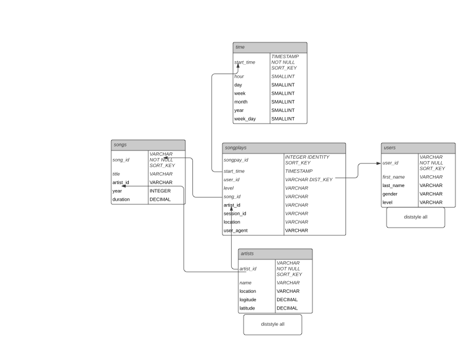

# Project - Dataware house
## quick start
1. open dwh.cfg and fillout aws key, screat and session.
2. run  `python3 aws_automation.py create` It will
    - Create IAM User and  IAM role for Redshift 
    and attach S3ReadOnlyAccess policy to it.
    - Create cluster for redshift based on configuration
    - Prints  cluster endpoint and role ARN
3. wait for 2-5 minutes and run `python3 aws_automation.py status`
    - wait till above command prints cluster is available status
4. run `python3 create_tables.py` it will
    - create DB schema for staging as well as DW fact and dimentions tables.
5. run `python3 etl.py` it will
    - copy  songs and event data from s3 to staging table(this will take time, 30-40 minutes)
    - Insert data from staging tables to Fact - songplays and Dimentions tables(users, artists, songs, time)
    - prints first 5000 rows of all fact/ dimentions tables for quality check.
## overview
This is ETL project for company sparkify. It gets large volume of JSON data from aws s3 , copies to redshift db staging table first and then it trasforms to relational DB with fact and dimention tables.
1. Copy data from s3 to redshift db sparkifydb
    - source: s3://udacity-dend/log-data where all JSON files for events data
    - source: s3://udacity-dend/song-data where all JSON files for songs data
    - imports all event data JSON files to staging_events table.
    - imports all songs data JSON files to staging_songs table.
2. sort and dist key for staging tables
    - staging_events table has page column as sort and dist key because we will filtering data based on page
    - staging_songs table is very big and major table for fact as well as dimentions tables. Since we are populating distict artist and songs with artist , it is better choice to user artist_id for sort as well as dist key. Song id can be too many to consider as dist key.
3. Populate fact songlays and dimentions tables(songs, artist, time, users)
4. sort and dist key for fact/dimention tables
    - users and artists tables make it available for all nodes using diststyle all

## ER diagram


## DB stats
1. Staging Tables
    - staging_events : 
    - staging_songs:
2. DW
    - Fact Table
        - songplays: 
    - Dimentions
        - songs: 
        - artists: 
        - users: 
        - time: 
## Test Query
1. Staging Tables
    ```
    SELECT
        COUNT(*)
    FROM
        staging_songs;
    ```
2. Fact Table
```
    SELECT  
        sp.songplay_id,
        u.user_id,
        s.song_id,
        u.last_name,
        sp.start_time,
        a.name,
        s.title
    FROM 
        songplays AS sp
    JOIN 
        users   AS u 
    ON 
        u.user_id = sp.user_id
    JOIN
        songs   AS s 
    ON 
        (s.song_id = sp.song_id)
    JOIN 
        artists AS a 
    ON 
        a.artist_id = sp.artist_id
    JOIN 
        time    AS t 
    ON
        t.start_time = sp.start_time
    ORDER BY
        sp.start_time
    LIMIT 1000; 
```
